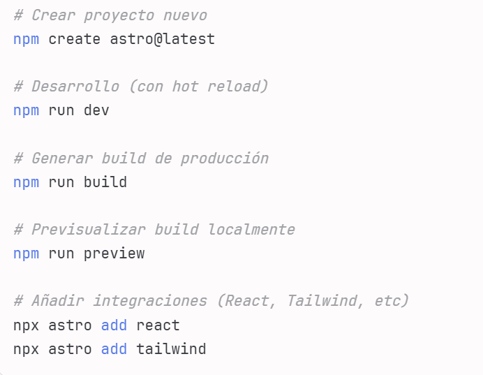

# Apuntes del Proyecto Portfolio con Astro 🚀

**Astro**
Framework para construir sitios web rápidos con menos JavaScript. Renderiza el contenido en el servidor y envía HTML estático al cliente para mejor rendimiento.
Se usa para construir sitios web estáticos,extremadamente rápidos y optimizados para SEO.(carga más rápida=mejor posicionamiento en buscadores).

**¿Cómo funciona?**
Astro renderiza todo el contenido en el servidor durante el build y genera HTML estático. Esto significa que cuando un usuario visita tu sitio, recibe páginas HTML ya preparadas, sin necesidad de ejecutar JavaScript pesado en el navegador.
**El flujo es:**

Durante desarrollo (npm run dev): Astro compila y sirve el contenido en tiempo real
Al hacer build (npm run build): Genera archivos HTML, CSS y JS optimizados listos para producción
Preview (npm run preview): Sirve localmente esos archivos estáticos para previsualizar exactamente lo que verán los usuarios

**Ventajas principales**

- Rendimiento superior: Menos JavaScript = carga más rápida
- SEO optimizado: El contenido HTML ya está renderizado, los buscadores lo indexan fácilmente
- Menor costo de hosting: Los archivos estáticos se pueden desplegar gratis en servicios como Vercel, Netlify o GitHub Pages
- Menor consumo de recursos: No necesita un servidor Node.js corriendo constantemente

-Tiene una arquitectura de islas donde solo los componentes interactivos cargan JavaScript, el resto es HTML estático.

-Es compatible con múltiples frameworks como React, Vue y Svelte en un mismo proyecto.

**Casos de uso**
Ideal para sitios web como blogs, portfolios, documentación y sitios corporativos donde el contenido estático es prioridad sobre interactividad compleja.

## Estructura del Proyecto

- **Layout.astro**: Es el archivo principal que define la estructura común de todas las páginas.
  Es como una plantilla o envoltorio común para todas las páginas.
  - Contiene: metadatos (title o meta) y la estructura básica HTML
  - Define: Barra de navegación, contenedor principal y footer
- **Welcome.astro**: Es un componente (sección) de la página principal
  - Contiene: La foto circular y el texto de presentación
  - ¿Por qué componente? Porque es una parte reutilizable de la interfaz
- **index.astro**: Es la página principal (home)

  - Usa el Layout y incluye el componente Welcome
  - Astro automáticamente convierte archivos en `pages` en rutas web

- **about.astro**: es la página de información personal que incluye también la parte de habilidades y skills junto con el botón de enlace al CV.

- **projects.astro**: Página que lista los proyectos destacados.

  - Utiliza el componente `ProjectCard.astro`(está dentro de la carpeta `components`) para mostrar cada proyecto como una tarjeta.
  - Permite mantener la presentación de proyectos ordenada visualmente .

- **ProjectCard.astro**: Componente reutilizable para mostrar la información de un proyecto.
  - Recibe datos como título, imagen, descripción y enlaces.
  - Se usa dentro de `projects.astro` para mostrar cada proyecto .

## Cómo Ejecutar el Proyecto

1. Abrir terminal en la carpeta del proyecto:

   ```powershell
   cd "portfolio-personal"
   ```

2. Instalar dependencias (solo la primera vez):

   ```powershell
   npm install
   ```

3. Iniciar servidor de desarrollo:

   ```powershell
   npm run dev
   ```

4. Abrir en el navegador:
   - URL: http://localhost:4321
   - NO usar "Live Server" - Astro tiene su propio servidor de desarrollo

**Comandos útiles:**



## Aclarar confusiones sobre si Astro necesita o no servidor

Astro genera sitios estáticos que no requieren un servidor backend para funcionar. En desarrollo, Astro corre un servidor local para facilitar la vista previa y el desarrollo, pero el sitio final es HTML estático.
Por tanto, en producción, no se necesita un servidor Node.js.

**CURIOSIDADES Y APUNTES VARIOS**
ETIQUETAS ARIA EN ENLACES:
**1.ARIA-LABEL** :

   <h1 aria-label="Volver al inicio">Ana</h1> lo que ves en pantalla es Ana pero un lector de pantalla dirá "Volver al inicio"
   o por ejemplo :aria-label="Cambiar tema" esto se usa en el botón de cambiar tema para que los lectores de pantalla digan "Cambiar tema" .
   **2.ARIA-HIDDEN**:
   <span aria-hidden="true">®</span> El atributo aria-hidden="true" NO oculta visualmente el elemento - el elemento seguirá siendo visible en la pantalla para los usuarios que pueden ver. Lo que hace es "ocultar" el elemento solo para los lectores de pantalla.

---

**order**
Funciona solo si el contenedor tiene display: flex.
No es muy conocido pero es muy útil para cambiar el orden visual de los elementos sin alterar el orden en el HTML.
En este proyecto se ha usado para que en móvil la imagen salga antes que el texto en la página about.
**SLOTS**
El archivo layout define la estructura que se va a repetir en todas (projects y en about) ya que todas esas páginas van a tener el mismo envoltorio (el mismo header y footer) y van a tener un slot que es donde se va a insertar el contenido específico de cada página (el contenido específico para about y para projects).
Por eso, Astro se estructura en componentes reutilizables que se importan/exportan, creando un sistema modular y mantenible.

**¿El localStorage siempre existe en el navegador?**

Sí, en todos los navegadores modernos existe el objeto `localStorage`. No guarda nada por sí mismo: sólo almacena lo que el desarrollador decide guardar mediante JavaScript. Es persistente (no se borra al cerrar el navegador) y sólo contiene los datos que tú decidas guardar. Se almacena en pares clave-valor como cadenas de texto.

Ejemplo:

```js
localStorage.setItem("tema", "oscuro"); // Guarda el valor 'oscuro' bajo la clave 'tema'.La clave es 'tema' y el valor es 'oscuro'.
```

**Uso de colores en variables CSS**
He usado variables CSS "CUSTOM PROPERTIES" para definir colores personalizados en el proyecto. Esto permite mantener una paleta de colores consistente y facilita los cambios globales de estilo.
Por ejemplo, si quiero cambiar el color primario de mi sitio, solo necesito actualizar el valor de la variable `--color-primary` en lugar de buscar y reemplazar todos los valores en el CSS.

---
