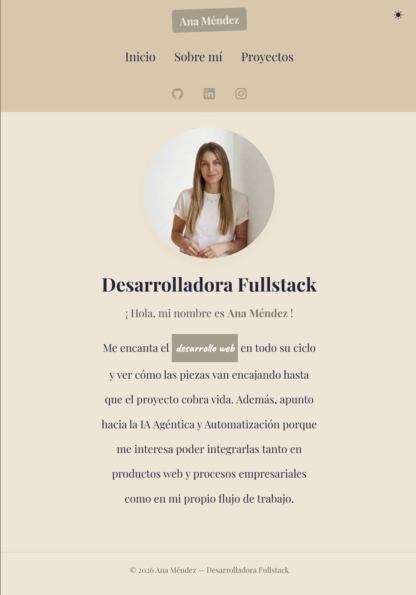
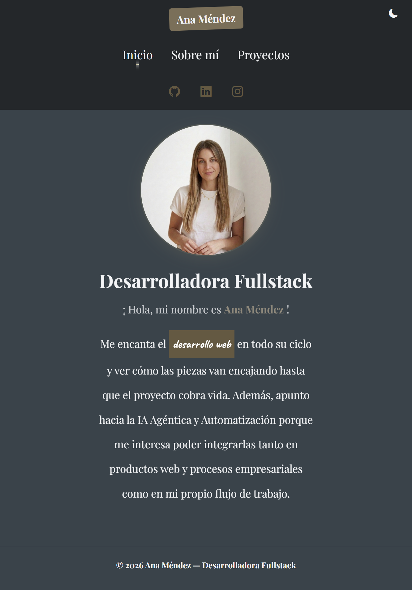
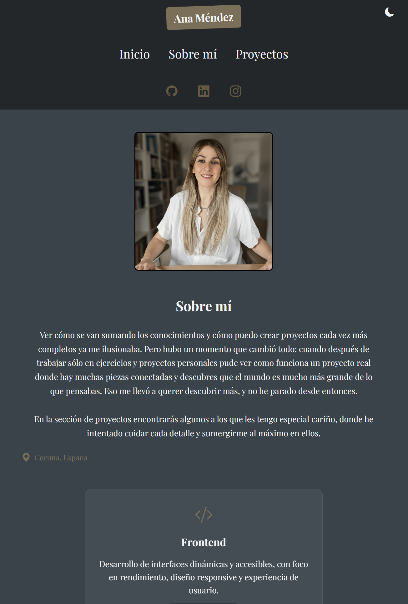
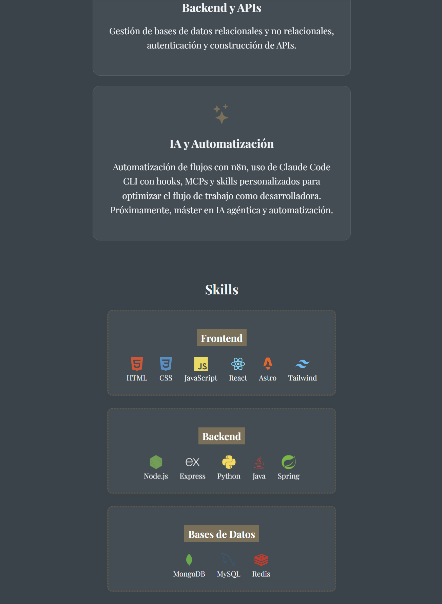
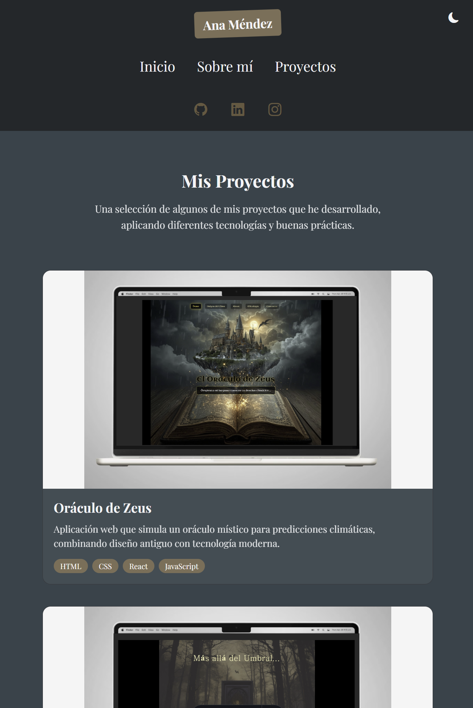

# Portfolio Personal — Ana Méndez

Portfolio personal desarrollado con **Astro**, con modo claro/oscuro, diseño responsive y secciones de presentación, sobre mí, skills y proyectos.

## 🚀 Estructura del proyecto

```text
/
├── public/
│   ├── images/
│   └── favicon.svg
├── src/
│   ├── components/
│   │   └── Welcome.astro
│   ├── layouts/
│   │   └── Layout.astro
│   └── pages/
│       ├── index.astro
│       ├── about.astro
│       └── projects.astro
└── package.json
```

## 🧞 Comandos

Todos los comandos se ejecutan desde la raíz del proyecto:

| Comando                   | Acción                                              |
| :------------------------ | :-------------------------------------------------- |
| `npm install`             | Instala las dependencias                            |
| `npm run dev`             | Inicia el servidor local en `localhost:4321`        |
| `npm run build`           | Genera la build de producción en `./dist/`          |
| `npm run preview`         | Previsualiza la build antes de desplegar            |
| `npm run astro ...`       | Ejecuta comandos de la CLI de Astro                 |

## 🛠️ Tecnologías

- [Astro](https://astro.build)
- HTML, CSS (variables, animaciones, media queries)
- Bootstrap Icons + Devicon
- Vercel (despliegue)

## 📸 Capturas

### Inicio — Modo claro


### Inicio — Modo oscuro


### Sobre mí


### Skills


### Proyectos

